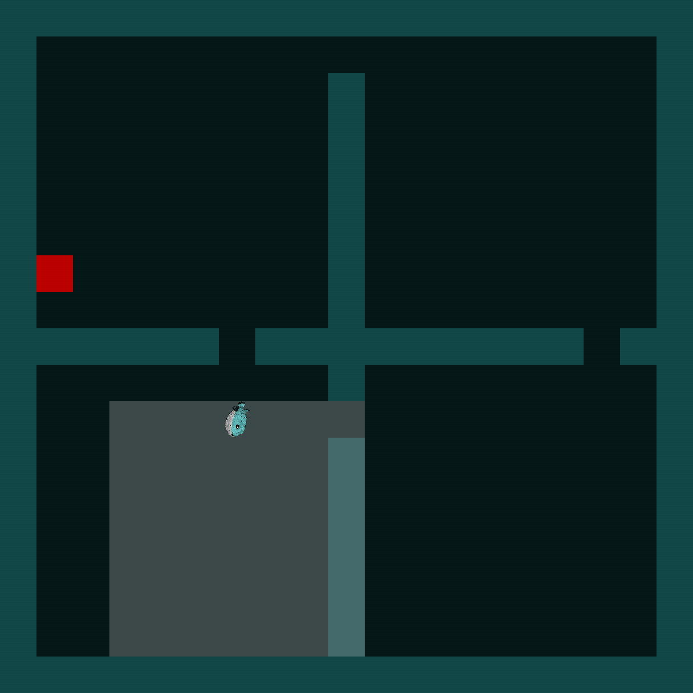

# PufferLib Four Rooms

This fork contains a Puffer-native implementation of MiniGrid's classic
[Four Rooms](https://minigrid.farama.org/environments/minigrid/FourRoomsEnv/)
environment (`MiniGrid-FourRooms-v0`).



The goal is to keep the environment small, fast, and easy to train inside
[PufferLib](https://github.com/PufferAI/PufferLib).

## Branches

- `dev`: active development branch. Includes local macOS CPU/MPS setup work.
- `four-rooms-4`: PR branch kept close to upstream PufferLib for submitting the
  Four Rooms environment changes.

## Quick Start

Build the CPU backend for Four Rooms:

```bash
uv run ./build.sh four_rooms --cpu
```

Run a short CPU training smoke test:

```bash
uv run puffer train four_rooms --slowly
```

On Apple Silicon, the PyTorch trainer can use MPS:

```bash
PUFFERLIB_TORCH_DEVICE=mps uv run puffer train four_rooms --slowly
```
